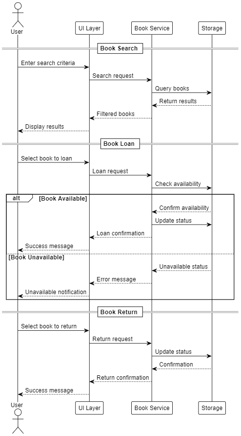

# Library Management System Developer Guide

## Table of Contents
1. [Introduction](#introduction)
2. [Architecture](#architecture)
3. [Design](#design)
4. [Implementation](#implementation)
5. [Testing](#testing)
6. [Documentation](#documentation)
7. [Development Workflow](#development-workflow)
8. [Dependencies](#dependencies)
9. [Build and Deployment](#build-and-deployment)
10. [Troubleshooting](#troubleshooting)

## Introduction
This guide provides comprehensive information for developers working on the Library Management System. It covers the system's architecture, design decisions, implementation details, and development guidelines.

## Architecture

### System Overview
The Library Management System follows a layered architecture:
- **Presentation Layer**: JavaFX-based UI components
- **Business Logic Layer**: Core application logic and services
- **Data Access Layer**: Data persistence and retrieval
- **Domain Layer**: Core business entities and models

### Architectural Diagrams
The following diagrams provide visual representations of the system architecture:

1. **System Architecture Overview**
   
   - Shows the layered architecture and component interactions
   - Illustrates data flow between layers
   - Highlights external dependencies

2. **Class Structure**
   
   - Displays the main classes and their relationships
   - Shows inheritance and composition
   - Highlights key interfaces

3. **Book Management Flow**
   
   - Shows the sequence of operations for book management
   - Illustrates component interactions
   - Highlights error handling

4. **Component Interaction Diagram**
   - Details the interaction between components during key operations
   - Shows the flow of data and control
   - Highlights service dependencies

5. **Data Flow Diagram**
   - Illustrates how data moves through the system
   - Shows data transformation points
   - Highlights validation and processing steps

6. **Deployment Architecture**
   - Shows the runtime environment
   - Illustrates configuration requirements
   - Highlights deployment dependencies

7. **Security Architecture**
   - Shows authentication and authorization flows
   - Illustrates security boundaries
   - Highlights data protection mechanisms

8. **Error Handling Flow**
   - Shows error detection and handling
   - Illustrates user feedback paths
   - Highlights logging and monitoring points

### Key Components
1. **User Interface**
   - JavaFX-based GUI
   - Scene Builder for UI design
   - FXML for layout definition

2. **Core Services**
   - Book Management Service
   - Loan Management Service
   - User Management Service
   - Search and Sorting Service

3. **Data Management**
   - File-based storage system
   - JSON data format
   - Data validation and integrity checks

## Design

### Design Patterns
The system implements several design patterns:
- **MVC (Model-View-Controller)**: For UI management
- **Singleton**: For service instances
- **Factory**: For object creation
- **Observer**: For event handling
- **Strategy**: For sorting and search algorithms

### Class Structure
```
src/main/java/
├── com.library
│   ├── controllers/     # UI controllers
│   ├── models/         # Data models
│   ├── services/       # Business logic
│   ├── utils/          # Utility classes
│   └── Main.java       # Application entry point
```

## Implementation

### Key Features Implementation
1. **Book Management**
   - ISBN validation
   - Book status tracking
   - Availability management

2. **Loan System**
   - Loan period tracking
   - Overdue calculation
   - Return processing

3. **User Management**
   - Authentication
   - Authorization
   - Role-based access control

4. **Search and Sorting**
   - Multiple search criteria
   - Custom sorting algorithms
   - Performance optimization

### Code Style Guidelines
1. **Naming Conventions**
   - Classes: PascalCase
   - Methods: camelCase
   - Variables: camelCase
   - Constants: UPPER_SNAKE_CASE

2. **Code Organization**
   - Maximum file length: 500 lines
   - Maximum method length: 50 lines
   - Maximum line length: 100 characters

3. **Documentation**
   - Javadoc for public methods
   - Inline comments for complex logic
   - Clear method and variable names

## Testing

### Testing Strategy
1. **Unit Tests**
   - JUnit 5 framework
   - Test coverage > 80%
   - Mock objects for dependencies

2. **Integration Tests**
   - Component interaction testing
   - Data flow verification
   - Error handling validation

3. **UI Tests**
   - JavaFX Test Framework
   - User interaction simulation
   - Layout verification

### Testing Guidelines
1. Write tests before implementing features
2. Maintain test coverage reports
3. Run tests before committing code
4. Document test cases

## Documentation

### Code Documentation
1. **Javadoc Requirements**
   - Class descriptions
   - Method documentation
   - Parameter descriptions
   - Return value documentation
   - Exception documentation

2. **Inline Comments**
   - Complex logic explanation
   - Algorithm descriptions
   - Important assumptions

### API Documentation
1. **Public API**
   - Service interfaces
   - Data models
   - Utility methods

2. **Internal API**
   - Implementation details
   - Private methods
   - Helper classes

## Development Workflow

### Version Control
1. **Branch Strategy**
   - main: Production code
   - develop: Development branch
   - feature/*: Feature branches
   - hotfix/*: Emergency fixes

2. **Commit Guidelines**
   - Atomic commits
   - Descriptive messages
   - Related changes together

### Code Review Process
1. Create pull request
2. Request review
3. Address feedback
4. Merge after approval

## Dependencies

### Core Dependencies
- Java 21
- JavaFX 17.0.7
- Jackson (JSON processing)
- JUnit 5
- TestFX

### Development Tools
- IntelliJ IDEA
- Scene Builder
- Git
- Gradle

## Build and Deployment

### Build Process
1. **Local Build**
   ```bash
   ./gradlew build
   ```

2. **Test Execution**
   ```bash
   ./gradlew test
   ```

3. **JAR Creation**
   ```bash
   ./gradlew shadowJar
   ```

### Deployment
1. **Requirements**
   - Java 21 Runtime
   - 2GB RAM minimum
   - 500MB disk space

2. **Installation**
   - Copy JAR file to target system
   - Create data directory
   - Set up configuration

## Troubleshooting

### Common Issues
1. **Build Problems**
   - Dependency conflicts
   - Version mismatches
   - Resource access issues

2. **Runtime Errors**
   - Memory issues
   - File access problems
   - UI rendering issues

### Debugging Guidelines
1. Use logging effectively
2. Check error messages
3. Verify data integrity
4. Test edge cases

## Support
For development support:
1. Check documentation
2. Review code examples
3. Contact senior developers
4. Create issue tickets 