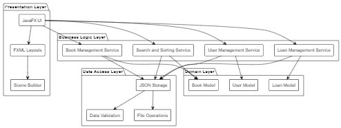
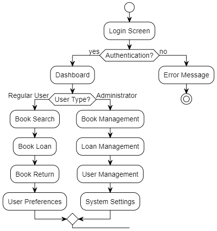
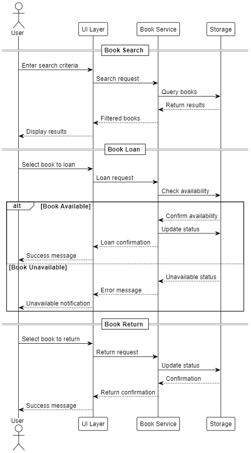

# Library Management System User Guide

## Table of Contents
1. [Introduction](#introduction)
2. [Getting Started](#getting-started)
3. [User Interface](#user-interface)
4. [Features](#features)
5. [User Roles](#user-roles)
6. [Book Management](#book-management)
7. [Loan Management](#loan-management)
8. [Search and Sorting](#search-and-sorting)
9. [User Preferences](#user-preferences)

## Introduction
The Library Management System is a Java-based application designed to help manage library operations efficiently. It provides features for book management, loan tracking, and user preferences.

### System Overview
The following diagrams provide a high-level understanding of the system:

1. **System Architecture Overview**
   
   - Shows the main components of the system
   - Illustrates how different parts work together
   - Helps understand the system's organization

2. **User Interface Flow**
   
   - Shows the navigation between different screens
   - Illustrates the main user paths
   - Helps understand how to navigate the system

3. **User Roles and Permissions**
   - Shows the different user types
   - Illustrates what each user type can do
   - Helps understand access levels

4. **Book Management Flow**
   
   - Shows the book lifecycle
   - Illustrates loan and return processes
   - Helps understand book operations

5. **Search and Sorting Flow**
   - Shows how to find and organize books
   - Illustrates available search options
   - Helps understand information retrieval

## Getting Started
1. Ensure you have Java 17 or later installed on your system
2. Launch the application by running the `LibraryManagementSystem` jar file
3. The application will start with a login screen

## User Interface
The application features a modern JavaFX-based graphical user interface with the following main components:
- Login Screen
- Dashboard
- Book Management Interface
- Loan Management Interface
- User Preferences Interface

## Features

### User Roles
The system supports two types of users:
1. **Regular Users**
   - Can view books
   - Can loan and return books
   - Can search books
   - Can customize personal preferences

2. **Administrators**
   - All regular user privileges
   - Can add and remove books
   - Can view all loans
   - Can manage sorted loan views

### Book Management
1. **Viewing Books**
   - View all available books in the library
   - View books sorted by various criteria
   - Search for specific books

2. **Book Operations**
   - Loan books (Regular Users)
   - Return books (Regular Users)
   - Add books (Administrators only)
   - Remove books (Administrators only)

### Loan Management
1. **Loan Operations**
   - Loan a book by entering its ISBN
   - Return a book by entering its ISBN
   - View all current loans
   - View sorted loan history (Administrators only)

### Search and Sorting
1. **Search Features**
   - Search books by various criteria
   - View search results in a sorted manner

2. **Sorting Options**
   - Sort books by:
     - Title
     - Author
     - ISBN
     - Status
   - Sort loans by various criteria (Administrators only)

### User Preferences
Users can customize their experience through:
1. **Book Sort Settings**
   - Choose default sorting criteria
   - Set default sort direction (ascending/descending)

2. **Loan Sort Settings**
   - Configure default loan sorting preferences

3. **Search Settings**
   - Set default search criteria
   - Configure search result display

4. **Display Settings**
   - Customize interface appearance

## Usage Instructions

### Logging In
1. Enter your username
2. Enter your password
3. Check the "Login as Administrator" box if you have administrator privileges
4. Click the "Login" button

### Managing Books
1. **To View Books**
   - Select "View all books" from the dashboard
   - Use the search function to find specific books

2. **To Loan a Book**
   - Select "Loan a book" from the dashboard
   - Enter the ISBN of the book you wish to loan
   - Confirm the loan

3. **To Return a Book**
   - Select "Return a book" from the dashboard
   - Enter the ISBN of the book you wish to return
   - Confirm the return

### Administrator Functions
1. **Adding a Book**
   - Select "Add a book" from the dashboard
   - Enter the book's ISBN, title, and author
   - Confirm the addition

2. **Removing a Book**
   - Select "Remove a book" from the dashboard
   - Enter the ISBN of the book to remove
   - Confirm the removal

### Managing Preferences
1. Access the "User Preferences" section from the dashboard
2. Select the category of preferences you wish to modify
3. Choose your preferred settings
4. Save your changes

## Troubleshooting
If you encounter any issues:
1. Ensure you have the correct user permissions for the operation
2. Verify that the book ISBN is correct
3. Check if the book is available for the operation
4. Contact your system administrator for assistance

## System Requirements
- Java 21 or later
- JavaFX 17.0.7
- Minimum 2GB RAM
- 500MB free disk space

## Support
For technical support or questions about the Library Management System, please contact your system administrator. 