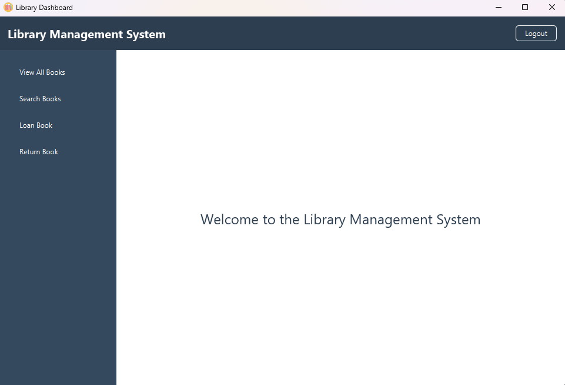

# Library Management System - User Guide

## Table of Contents

1.  [Introduction](#introduction)
2.  [Getting Started](#getting-started)
3.  [User Interface Overview](#user-interface-overview)
4.  [Core Features](#core-features)
5.  [Step-by-Step Usage Instructions](#step-by-step-usage-instructions)
6.  [Troubleshooting](#troubleshooting)
7.  [System Requirements](#system-requirements)
8.  [Support](#support)

## Introduction

### Purpose

Welcome to the Library Management System User Guide. This document provides comprehensive instructions on how to effectively use the application for managing library resources, tracking book loans, and customizing user settings. This system is designed for both regular library users and administrators.

### System Overview

The Library Management System is a desktop application built using Java and JavaFX. It offers a graphical interface for interacting with the library's catalog and loan records.

The diagram above provides a visual representation of the user interface flow, illustrating the typical navigation paths between the application's different screens.

## Getting Started

### Prerequisites

*   Ensure **Java 21 or a later version** is installed on your computer. You can verify your Java version by opening a terminal or command prompt and typing `java -version`.

### Launching the Application

1.  Locate the application file: `LibraryManagementSystem.jar`.
2.  Double-click the `.jar` file to run it. Alternatively, open a terminal or command prompt, navigate to the directory containing the file, and execute the command: `java -jar LibraryManagementSystem.jar`.
3.  The application will launch and display the Login Screen.

## User Interface Overview

The application utilizes a modern JavaFX interface designed for ease of use.

### Main Components

*   **Login Screen:** Authenticates users (Regular or Administrator).
*   **Dashboard:** The main hub after login, providing access to different features via a sidebar or main panel buttons.
*   **Book Management Screens:** Interfaces for viewing, searching, adding (Admin), and removing (Admin) books.
*   **Loan Management Screens:** Interfaces for loaning, returning, and viewing loan records.

## Core Features

### User Roles

The system defines two distinct user roles with different capabilities:

1.  **Regular Users:**
   *   View the library catalog.
   *   Search for books using various criteria.
   *   Loan available books.
   *   Return books they have loaned.
   *   View their own current loans.

2.  **Administrators:**
   *   Possess all privileges of Regular Users.
   *   Add new books to the library catalog.
   *   Remove existing books from the catalog.
   *   View all loans across all users.
   *   Access advanced sorting options for loan views.

### Book Management

*   **Catalog Viewing:** Browse the complete list of books available in the library.
*   **Book Search:** Find specific books by Title, Author, or ISBN.
*   **Loan Operations:** Initiate the process to loan an available book.
*   **Return Operations:** Initiate the process to return a currently loaned book.
*   **Adding Books (Admin):** Add new book records (ISBN, Title, Author) to the system.
*   **Removing Books (Admin):** Remove book records from the system.

### Loan Management

*   **Loaning:** Check out a book using its unique ISBN. The book's status changes from 'AVAILABLE' to 'ON LOAN'.
*   **Returning:** Check in a book using its ISBN. The book's status changes back to 'AVAILABLE'.
*   **Viewing Loans:** Regular users can view their active loans. Administrators can view all active loans in the system.
*   **Loan History & Sorting (Admin):** Administrators can view and sort historical loan data based on various criteria.

### Search and Sorting

*   **Flexible Search:** Search the book catalog using fields like Title, Author, or ISBN.
*   **Configurable Sorting:**
   *   **Books:** Sort displayed book lists by Title, Author, ISBN, or Status (Available/On Loan).
   *   **Loans (Admin):** Sort loan records by criteria such as borrower, book title, loan date, or due date.

## Step-by-Step Usage Instructions

### Logging In

1.  On the Login Screen, enter your assigned **Username**.
2.  Enter your **Password**.
3.  If you are an administrator, check the **"Login as Administrator"** checkbox.
4.  Click the **"Login"** button. Upon successful authentication, you will be directed to the Dashboard.

### Common User Tasks

*(Accessed primarily from the Dashboard sidebar or main panel)*

1.  **Viewing Available Books:**
   *   Click **"View All Books"** to see the entire catalog. Results can be sorted using column headers.

2.  **Searching for Books:**
   *   Click **"Search Books"**.
   *   Enter your search term (e.g., title, author, ISBN) into the appropriate field.
   *   Click the **"Search"** button. Results matching your query will be displayed.

3.  **Loaning a Book:**
   *   *Method 1 (Direct Loan):*
      *   Click **"Loan a Book"**.
      *   Enter the exact **ISBN** of the desired book.
      *   Click **"Loan Book"**. Confirmation or error messages will appear.
   *   *Method 2 (From Search/View):*
      *   Find the book via **"View All Books"** or **"Search Books"**.
      *   If the book's status is 'AVAILABLE', a **"Loan"** button should be active in its row. Click it.

4.  **Returning a Book:**
   *   *Method 1 (Direct Return):*
      *   Click **"Return a Book"**.
      *   Enter the exact **ISBN** of the book you are returning.
      *   Click **"Return Book"**.
   *   *Method 2 (From Loan List):*
      *   Navigate to your loan list (e.g., **"My Loans"**).
      *   Find the book you wish to return.
      *   Click the **"Return"** button associated with that loan entry.

5.  **Viewing Your Loans:**
   *   Click **"My Loans"** (or a similar option) to see a list of books currently checked out under your account.

### Administrator-Specific Tasks

*(Accessed primarily from the Dashboard sidebar or main panel)*

1.  **Adding a New Book:**
   *   Click **"Add a Book"**.
   *   Fill in the required fields: **ISBN**, **Title**, **Author**. Ensure the ISBN is unique.
   *   Click **"Add Book"**.

2.  **Removing an Existing Book:**
   *   *Method 1 (Direct Remove):*
      *   Click **"Remove a Book"**.
      *   Enter the exact **ISBN** of the book to be removed.
      *   Click **"Remove Book"**. Be cautious, as this action is typically permanent.
   *   *Method 2 (From Search/View):*
      *   Find the book via **"View All Books"** or **"Search Books"**.
      *   Click the **"Remove"** button associated with the book's entry. Confirm the action if prompted.

3.  **Viewing All User Loans:**
   *   Click **"View All Loans"** or a similar administrative option. This displays all active loans across all users, often with advanced sorting capabilities.

## Troubleshooting

If you encounter problems while using the application:

1.  **Permission Errors:** Ensure you are logged in with the correct role (Regular User vs. Administrator) for the action you are attempting. Administrators have broader permissions.
2.  **Incorrect ISBN:** Double-check that you have entered the correct and complete ISBN for loaning, returning, or removing books. Typos are common.
3.  **Book Status Issues:** Verify the book's current status. You cannot loan a book that is already 'ON LOAN', nor can you return a book that is 'AVAILABLE'.
4.  **Application Not Launching:** Confirm Java 21+ is installed correctly and accessible from your system's PATH environment variable. Try launching from the command line (`java -jar LibraryManagementSystem.jar`) to see potential error messages.
5.  **Unexpected Behavior:** Restart the application. If the issue persists, note the steps taken to reproduce the problem.

## System Requirements

*   **Operating System:** Windows, macOS, or Linux (compatible with Java 21)
*   **Java Runtime Environment:** JRE or JDK Version 21 or later
*   **JavaFX:** Version 17.0.7 or compatible (often bundled or required separately depending on the Java distribution)
*   **RAM:** Minimum 2 GB recommended
*   **Disk Space:** Minimum 500 MB free space for the application and data